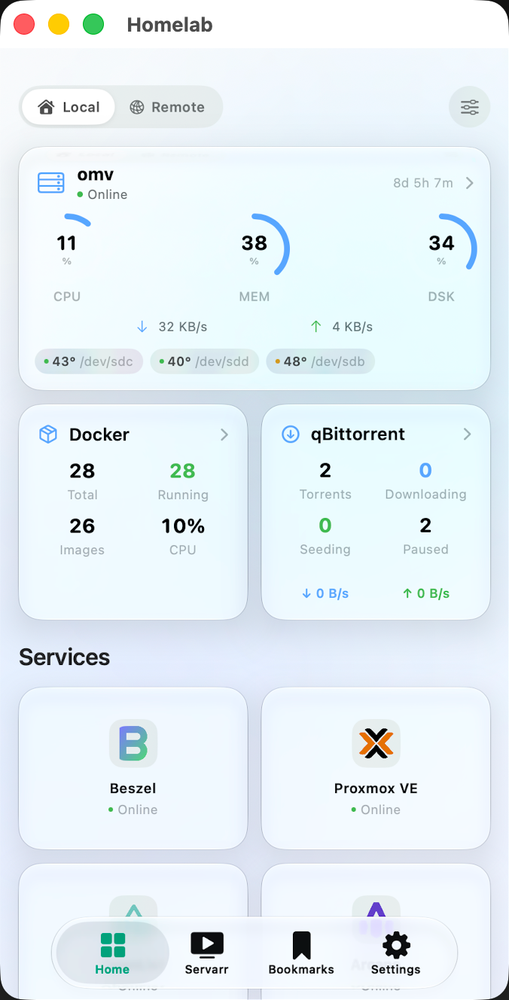
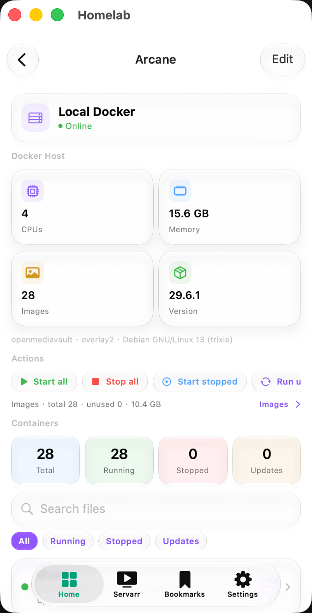

# Homelab

[English](README.md) · [中文](README.zh-CN.md)

[](LICENSE)
[](HomelabSwift/)
[](https://github.com/JohnnWi/homelab-project)

这是 [JohnnWi](https://github.com/JohnnWi) 的 [**Homelab Dashboard**](https://github.com/JohnnWi/homelab-project) 的个人 **iOS** fork。

<p align="center">
  
  &nbsp;
  
</p>

<p align="center"><sub>首页概览 · Arcane（Docker）</sub></p>

---

## 致谢与上游关系

本项目是 **fork**，不是从零重写。

| | |
| --- | --- |
| **上游仓库** | [JohnnWi/homelab-project](https://github.com/JohnnWi/homelab-project)（已归档） |
| **原项目** | Homelab Dashboard — 面向自建服务的原生移动客户端 |
| **本仓库** | [unitsung/homelab-project](https://github.com/unitsung/homelab-project) |

**感谢 JohnnWi 以及所有上游贡献者。** 上游已经把多服务仪表盘、多实例、备份、生物识别解锁与整体架构做得非常扎实。这个 fork 正是站在这份优秀工作之上，只是按**我自己的 NAS / 日常习惯**往上补模块。

完整的原版功能列表、集成服务（约 34 个）、截图与历史文档，请直接阅读 [上游 README](https://github.com/JohnnWi/homelab-project)。这里不整份抄录，避免与代码脱节。

---

## 为什么 fork

并不是要取代 Homelab Dashboard，而是：

> 保留上游客户端，再**加上自己 Homelab / NAS 日常会用到的模块**，让手机端管理更顺手。

我这边大致包括：

- 主机：**[OpenMediaVault](https://www.openmediavault.org/)**
- Docker：**[Arcane](https://github.com/getarcaneapp/arcane)** 为主
- 以及 OpenList、CloudSaver 等实际在用的工具

服务面板与交互大多仍来自上游。本仓库**积极维护 iOS**（`HomelabSwift/`）。Android 树仅保留，不在此开发——需要 Android 可参考 [kinderdash](https://github.com/ChaosieKinder/kinderdash)。

如果你也用得上，欢迎自取。只要我自己还在用，就会**继续维护**，优先级放在让**自己用着爽**的那部分（OMV、Arcane、自加模块等）。不保证覆盖所有场景；对你有帮助就更好了。

应用内更新只针对本 fork 的 bundle（`com.unitsung.myhomelab`），不会影响上游用户的安装与更新通道。

---

## 编译（iOS）

```text
HomelabSwift/Homelab.xcodeproj
```

1. 用较新的 **Xcode** 打开项目（本树目标 **iOS 26+**）。
2. 配置开发者签名。
3. 在真机上运行。

是否使用 SideStore / AltStore Classic 等侧载方式由你自行决定。仓库中的 IPA / `apps.json` 元数据主要是我自己装包用的。

本仓库 CI **只跑 iOS 编译检查**（Android 流水线已关闭）。

---

## 许可与版权

本 fork 与上游相同，采用 **[Apache License 2.0](LICENSE)**。

请同时阅读 **[NOTICE](NOTICE)**，其中记录了对原 Homelab Dashboard 与本分发的归属说明。

简要说明（非正式法律意见，以完整许可文本为准）：

1. 再分发时保留 Apache 2.0 的 `LICENSE`。
2. 保留版权与致谢声明（`NOTICE` 及源码中的相关声明）。
3. 说明软件包含修改（本 fork 即是）。
4. 可对自己的修改添加版权声明。
5. 不得以暗示原作者背书的方式使用其商标或名义。

**版权**

- 原 Homelab Dashboard：JohnnWi / finalyxre 与上游贡献者  
  上游：https://github.com/JohnnWi/homelab-project  
- 本仓库修改：见 [提交历史](https://github.com/unitsung/homelab-project/commits/main) 与 `NOTICE`

软件按**现状**提供，不附带任何保证，使用风险自负。
